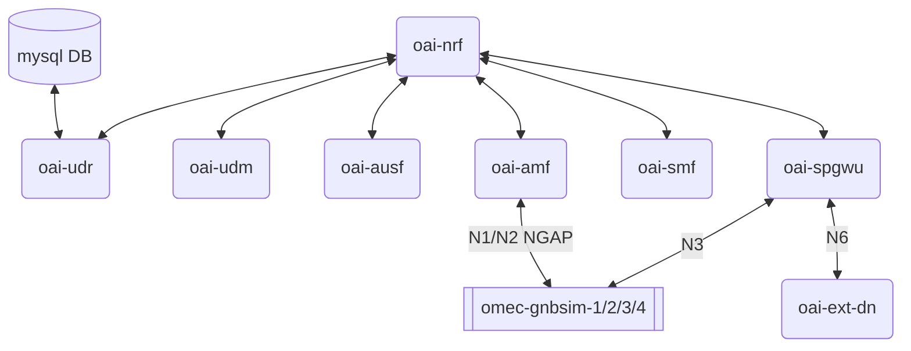
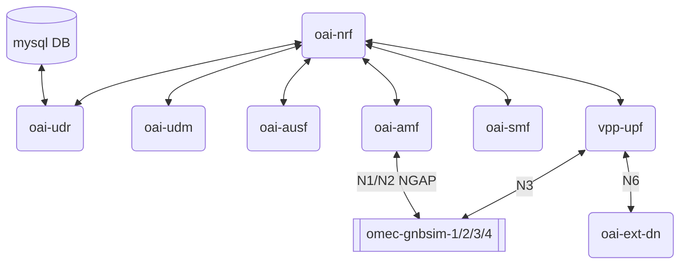

# Testing the OAI 5G Core Network with the Omec-gnbsim

This test-framework is mainly dedicated to perform load tests. This might become obsolete if our modifications to `omec-gnbsim` breaks the current yaml configuration support.

This test-framework is mainly targeted to the OAI 5G Core developers. It does not address how to retrieve/build images, capture PCAP or retrieve containers' logs.

## Images retrieval or build

This tutorial assumes that you are already have OAI 5G core images on your test server.

The image tags used are:

* `oai-xxx:develop`
* `mysql:5.7`
* `trf-gen-cn5g:latest`
* `5gc-gnbsim:0.0.1-dev`

There are plenty of material to retrieve the images from Docker-Hub and retag them.

For the `omec-gnbsim`, you can also build it yourself:

```bash
cd ROOT_OF_REPO
./scripts/sync-sub-modules.py --synchronize --force
cd ROOT_OF_REPO/third_party/gnbsim
make docker-build
```

## Testing with the normal basic deployment

The deployment is using 2 docker-compose files:

1. `docker-compose-basic-nrf.yaml`
2. `docker-compose-omec-gnbsim.yaml`

It will result in the following container deployment view:



All the interfaces (the ones that are shown and the invisible ones) are all on the same docker network:

* `demo-oai-public-net`

The following commands are based on the GitHub Action workflow :

* `.github/workflows/build_legacy_gnbsim.yml` --> job: `sanity-test-legacy-x64`

You may need to install `matplotlib`: `pip3 install matplotlib`

### Increase the database with thousands of UEs

```bash
cd ROOT_OF_REPO/test
awk -f scripts/insert-ues-to-sql-database.awk database/oai_db2.sql > database/oai_db2_big.sql
mv database/oai_db2_big.sql database/oai_db2.sql
```

You **SHALL** only do this once. If you are doing it multiple times, just `git checkout -- database/oai_db2.sql` and do it again.

Once the `UDR` supports REST API to add subscribers, I will replace w/ curl commands.

If you want to change the number of subscribers: edit `scripts/insert-ues-to-sql-database.awk` and replace the `4000` value:

```awk
BEGIN{n=4000}
```

### Deploy the 5G core network

Either you do it in 2 steps like in the workflow job, or in a single command:

```bash
docker-compose -f docker-compose-basic-nrf.yaml up -d
./check-oai-cn5g-status.py
```

### Deploy the RAN emulator(s)

If you want to deploy all of the `gnbsim` instances:

```bash
docker-compose -f docker-compose-omec-gnbsim.yaml up -d
./check-omec-gnbsim-status.py
```

By default, the `scripts/insert-ues-to-sql-database.awk` adds `4000` subscribers.

Each gnbsim instance can test up to `1000` UEs. See `omec-gnbsim-config-*.yaml`, profile `profile9-*`

--> Currently the `ueCount` is set to `100` --> can be modified up to `1000`.

If you are only deploying `omec-gnbsim-1` you can change the `ueCount` up to `4000`.

The `./check-omec-gnbsim-status.py` script will generate 2 `PNG` figures that profiles the CPU and memory usage of each NF.

### Undeploy RAN emulator(s)

```bash
docker-compose -f docker-compose-omec-gnbsim.yaml down -t 0
```

### Undeploy 5G Core Network

```bash
docker-compose -f docker-compose-basic-nrf.yaml down -t 0
docker volume prune --force
```

## Testing with VPP-UPF version of basic deployment

The deployment is using 2 docker-compose files:

1. `docker-compose-basic-vpp-nrf.yaml`
2. `docker-compose-omec-gnbsim.yaml`

The second one has to be modified to fit.

It will result in the following container deployment view:



The interfaces are mapped on the following docker networks:

* `oai-public-access` is carrying `N3`
* `oai-public-core` is carrying `N6`
* `demo-oai-public-net` is carrying `N1/N2 NGAP` and all the other interfaces

The following commands are based on the GitHub Action workflow :

* `.github/workflows/build_legacy_gnbsim.yml` --> job: `sanity-test-legacy-vpp-x64`

You may need to install `matplotlib`: `pip3 install matplotlib`

### Adapt to VPP the omec-gnbsim files

```bash
cd ROOT_OF_REPO/test
awk -f scripts/adapt-omec-gnbsim-to-vpp.awk docker-compose-omec-gnbsim.yaml > docker-compose-omec-gnbsim.yaml.new
mv docker-compose-omec-gnbsim.yaml.new docker-compose-omec-gnbsim.yaml
awk -f scripts/adapt-omec-gnbsim-to-vpp.awk omec-gnbsim-config-1.yaml > omec-gnbsim-config-1.yaml.new
mv omec-gnbsim-config-1.yaml.new omec-gnbsim-config-1.yaml
awk -f scripts/adapt-omec-gnbsim-to-vpp.awk omec-gnbsim-config-2.yaml > omec-gnbsim-config-2.yaml.new
mv omec-gnbsim-config-2.yaml.new omec-gnbsim-config-2.yaml
awk -f scripts/adapt-omec-gnbsim-to-vpp.awk omec-gnbsim-config-3.yaml > omec-gnbsim-config-3.yaml.new
mv omec-gnbsim-config-3.yaml.new omec-gnbsim-config-3.yaml
awk -f scripts/adapt-omec-gnbsim-to-vpp.awk omec-gnbsim-config-4.yaml > omec-gnbsim-config-4.yaml.new
```

### Increase the database with thousands of UEs

See same section above.

### Deploy OAI 5G Core Network

Either you do it in 2 steps like in the workflow job, or in a single command:

```bash
docker-compose -f docker-compose-basic-vpp-nrf.yaml up -d
./check-oai-cn5g-status.py --vpp-upf
```

### Deploy the RAN emulator(s)

If you want to deploy all of the `gnbsim` instances:

```bash
docker-compose -f docker-compose-omec-gnbsim.yaml up -d
./check-omec-gnbsim-status.py --vpp-upf
```

By default, the `scripts/insert-ues-to-sql-database.awk` adds `4000` subscribers.

Each gnbsim instance can test up to `1000` UEs. See `omec-gnbsim-config-*.yaml`, profile `profile9-*`

--> Currently the `ueCount` is set to `100` --> can be modified up to `1000`.

If you are only deploying `omec-gnbsim-1` you can change the `ueCount` up to `4000`.

The `./check-omec-gnbsim-status.py` script will generate 2 `PNG` figures that profiles the CPU and memory usage of each NF.

Note that the VPP-UPF is not profiled. `docker stats` does not report CPU nor memory usage.

### Undeploy RAN emulator(s)

```bash
docker-compose -f docker-compose-omec-gnbsim.yaml down -t 0
```

### Undeploy 5G Core Network

```bash
docker-compose -f docker-compose-basic-vpp-nrf.yaml down -t 0
docker volume prune --force
```

